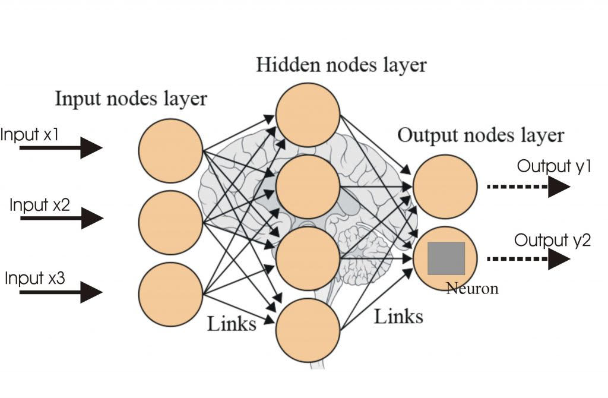

# **Exploring Neural Networks**

**Overview:**

This document will provide a sense of the general motivation for the project. It will also explain, at a high level, the technologies used and techniques deployed, as well as potential takeaways and areas for further improvement/exploration.

**Motivation:**

Because of the ever-increasing complexity and fascinating nature of neural networks and their potential for changing the world as we know it, it seems important to intimately understand the foundational principles and components that govern and underpin the most popular technologies and techniques in the space.

**Interpretation:**

In order to truly understand and appreciate the developments in the field of neural networking, the guided construction of even the most basic neural network in a way that, at least initially, does not leverage the typical packages and libraries that are widely used, seems an appropriate endeavor.

**Tools and Techniques:**

Python

Jupyter Notebook

**Potential Takeaways/Implications:**

Many of the most commonly used packages and libraries can be traced back to some of the most fundamental building blocks of machine learning. These building blocks tie back to mathematics, statistics, and basic computer programming.

**Areas for Improvement and/or Future Exploration:**

The development of confidence in constructing what is complex from what is simple is a strong motivator for future exploration of other machine learning models, including more basic models, deep learning, etc.

**Author(s):**

Daniel S. Toohey

**Acknowledgements/Links:**

Neural Networks from Scratch in Python by Harrison Kinsley &amp; Daniel Kukiela ([https://nnfs.io](https://nnfs.io/))